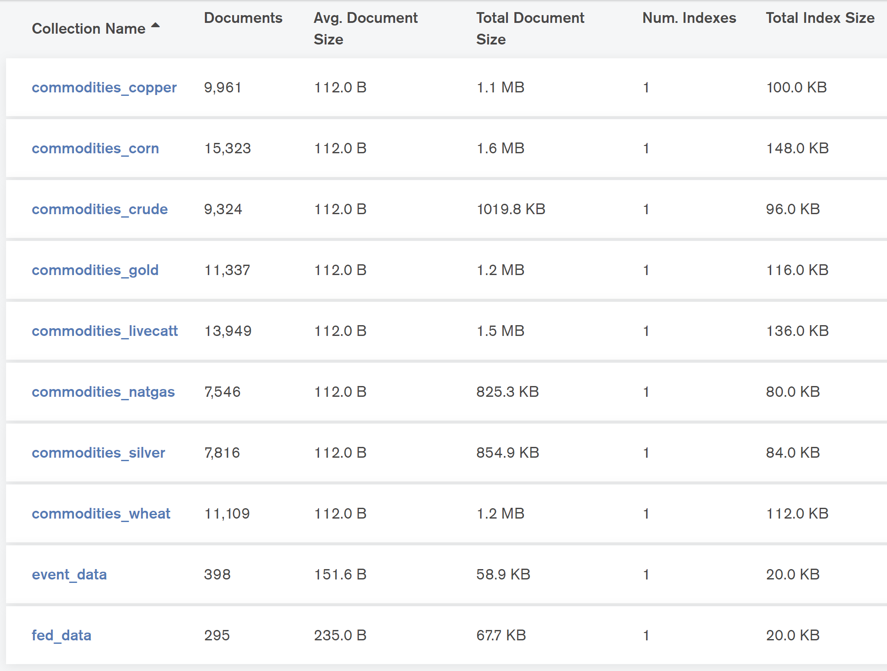
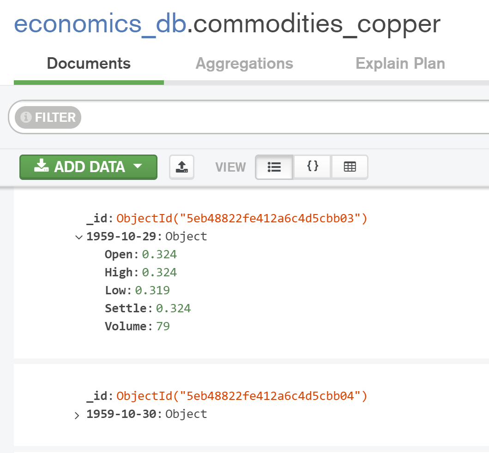
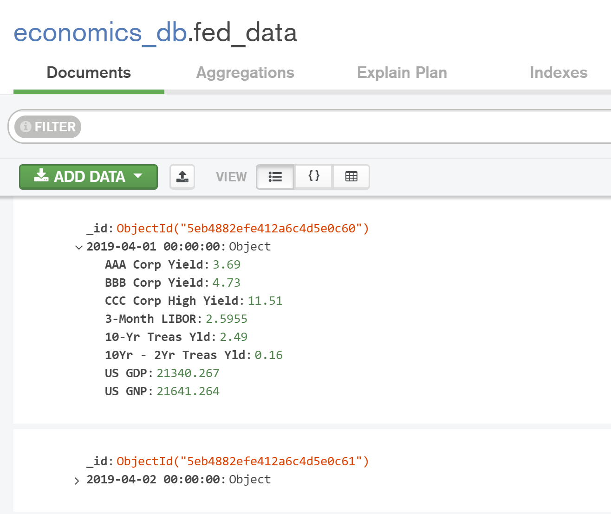
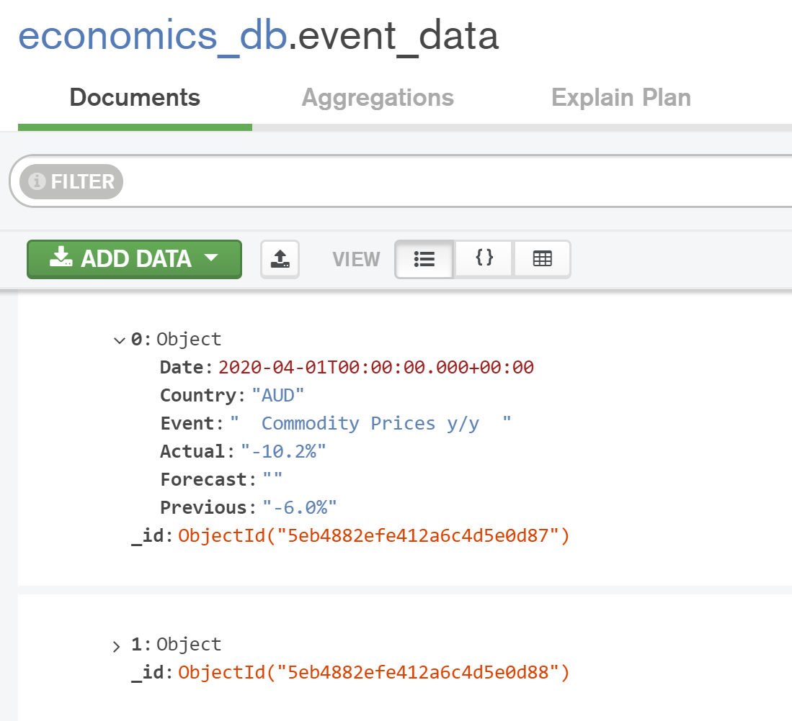

# ETL-Project

by Benjamin Aubry, Gary Fisher, and Bruce Mark.
 
 
 
This project was about building a database containing financial data (i.e. historical prices for commodities, Federal Reserve data, and economic event data) that could be used for further data analysis. 

The different data sources as well as data structures (API, Web) led to the creation of a MongoDB which offers flexibility for this type of data storage.  

The database ingests 3 different data sources (see below):
   * www.quandl.com – commodities historical prices (via API)
   * www.stlouisfed.org – Federal Reserve Data (via API)
   * www.forexfactory.com – Economic event calendar (Web-Scraping)
 
 
The following information explains the steps taken:
 
 

   1. An initial setup needed to take place before performing the ETL process.
      * Obtained API keys, installed requirement files, and imported dependencies for quandl.com API and stlouisfed.org API. 
         * References: 
            - [Obtain a Quandl API Key](https://docs.quandl.com/docs#section-authentication)
            - [Obtain a "FRED" (Federal Reserve) API Key](https://fred.stlouisfed.org/docs/api/api_key.html)
            - [Install Instructions for Quandl API Python Package](https://docs.quandl.com/docs/python-installation)
            - [Install Instructions for "FRED" (Federal Reserve) API Python Package](https://github.com/jjotterson/datapungi_fed)
      * Created a .get() request path using BeautifulSoup, analyzed the returned table elements, and decided which were to be extracted from forexfactory.com.
         * References:
            - [URL for the forexfactory.com Economic Event Calendar](https://www.forexfactory.com/calendar?month=last)
            

*** After the initial setup was completed, the ETL process began. ***

  

  

  

  

