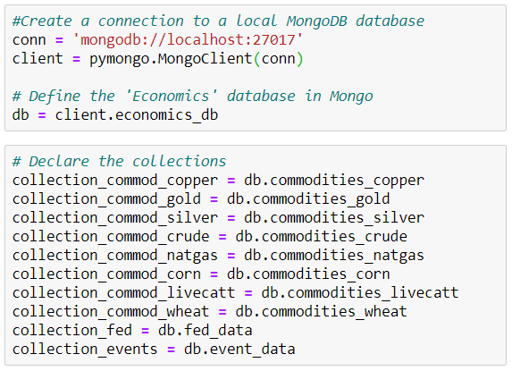
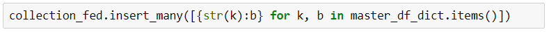
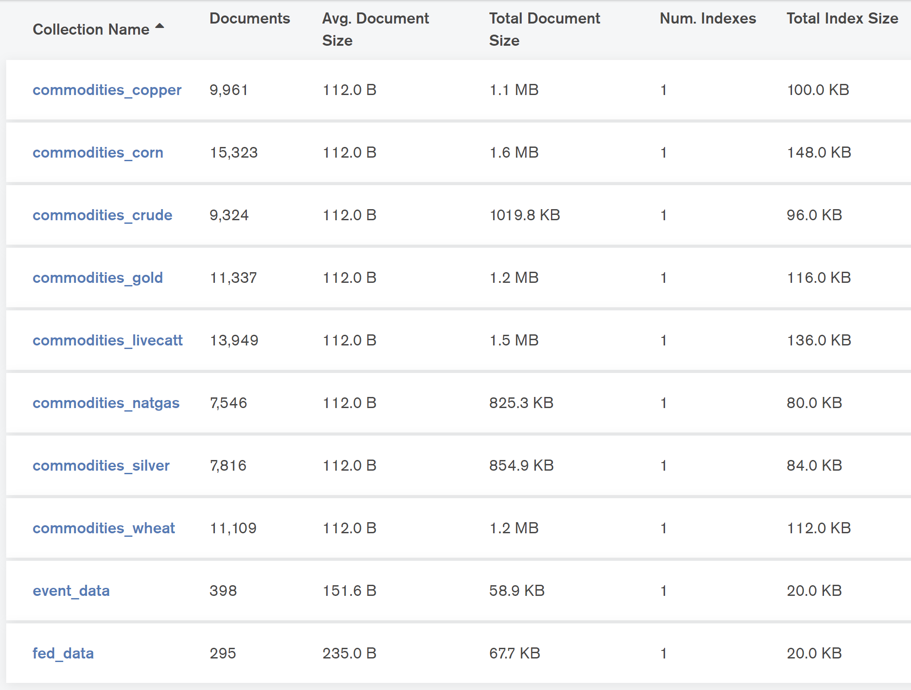
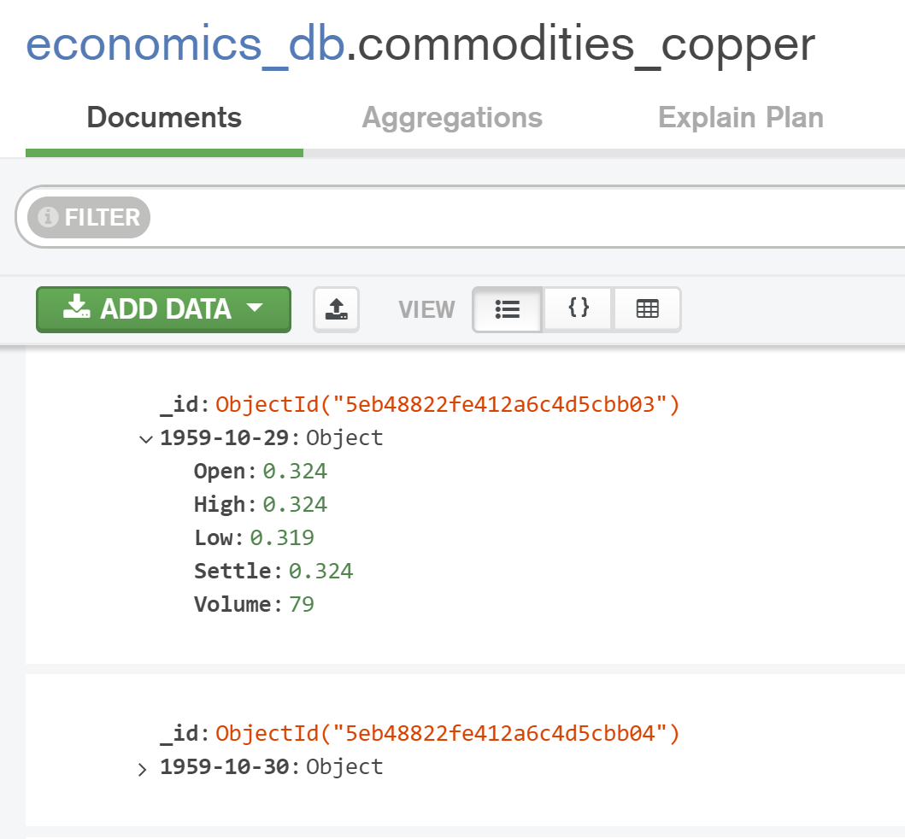
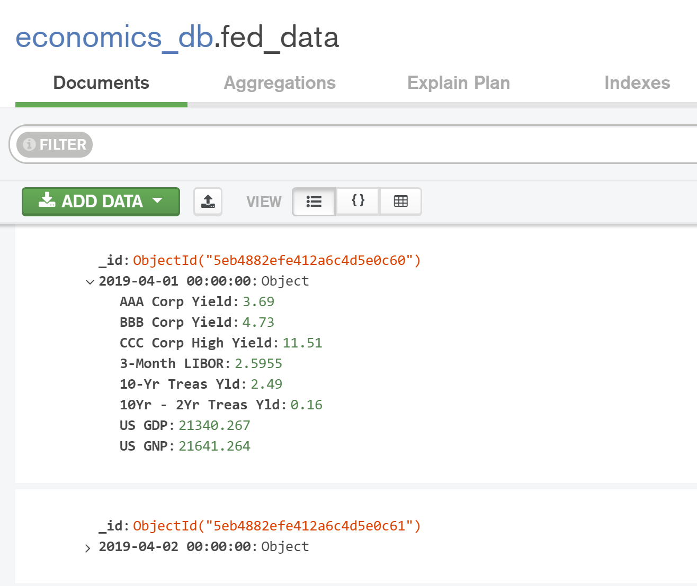
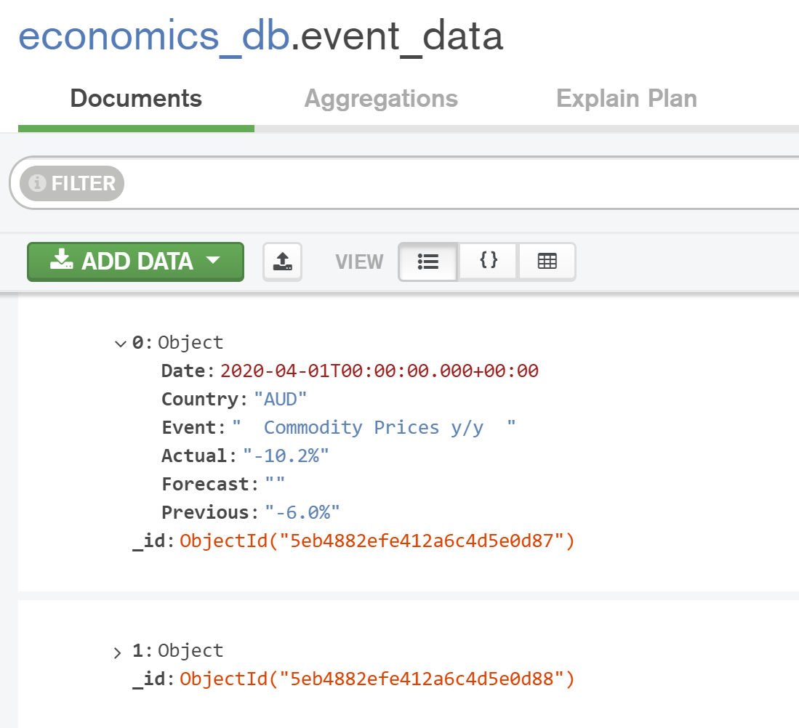

# ETL-Project

by Benjamin Aubry, Gary Fisher, and Bruce Mark.
 
 
 
This project was about building a database containing financial data (i.e. historical prices for commodities, Federal Reserve data, and economic event data) that could be used for further data analysis. 

The different data sources as well as data structures (API, Web) led to the creation of a MongoDB which offers flexibility for this type of data storage.  

The database ingests 3 different data sources (see below):
   * www.quandl.com – commodities historical prices (via API)
   * www.stlouisfed.org – Federal Reserve Data (via API)
   * www.forexfactory.com – Economic event calendar (Web-Scraping)
 
 
The following information explains the steps taken:
 
 

   1. An initial setup needed to take place before performing the ETL process.
      1. Obtained API keys, installed requirement files, and imported dependencies for quandl.com API and stlouisfed.org API. 
         * References: 
            - [Obtain a Quandl API Key](https://docs.quandl.com/docs#section-authentication)
            - [Obtain a "FRED" (Federal Reserve) API Key](https://fred.stlouisfed.org/docs/api/api_key.html)
            - [Install Instructions for Quandl API Python Package](https://docs.quandl.com/docs/python-installation)
            - [Install Instructions for "FRED" (Federal Reserve) API Python Package](https://github.com/jjotterson/datapungi_fed)
      2. Created a .get() request path using BeautifulSoup, analyzed the returned table elements, and decided which were to be extracted from forexfactory.com.
         * References:
            - [URL for the forexfactory.com Economic Event Calendar](https://www.forexfactory.com/calendar?month=last)
            
 

*** After the initial setup was completed, the ETL process began. ***

 

   **2. EXTRACT:** The following 3 data sources were used to pull the needed data.
   
      1. Source: quandle.com (API) – Commodities Futures Historical Data
         1. copper_2nd.csv
         2. gold_2nd.csv
         3. silver_2nd.csv
         4. crude_2nd.csv
         5. natgas_2nd.csv
         6. corn_2nd.csv
         7. livecatt_2nd.csv
         8. K_Wheat_2nd.csv 

      2. Source: St. Louis Federal Reserve (FRED API) – Historical Economic Data
         1. AAA Corp Yield
         2. BBB Corp Yield
         3. CCC Corp High Yield
         4. 3-Month LIBOR
         5. 10-Yr Treas Yld
         6. 10Yr - 2Yr Treas Yld
         7. US GDP
         8. US GNP

      3. Source: ForexFactory.com 
         1. Global Economic Event Calendar

   **3. TRANSFORM:**
      
      1. Quandl:
         * Read the extracted csv's into a pandas dataframe.
         * Set columns to "Date", "Open", "High", "Low", "Settle", and "Volume" for each dataframe.
         * Set index on all dataframes to "Date".
         * Created dictionaries from dataframes for MongoDB load.
      2. Federal Reserve "FRED":
         * Merged all extracted datasets into one pandas dataframe.
         * Renamed columns and set index to "Date".
         * Limited the dataset to only include dates after April 1st 2019.
         * Created dictionary from dataframe for MongoDB load.
      3. ForexFactory:
         * Created a pandas dataframe from extracted calendar event data.
         * Set columns to only include extracted event data for "Date", "Country", "Event", "Actual", "Forecast", and "Previous".
         * Set dataframe index to "Date" and dropped all rows with "NaN" and "None" values.
         * Reset the index and applied function to drop the day of the week in "Date" values.
         * Replaced blank cells with "NaN" and filled the "NaN" values with the date of the respective economic event.
         * Converted "Date" values to type datetime.
         * Created dictionary from dataframe for MongoDB load.
         
   **4. LOAD:**
   
      1. Created a connection to a local MongoDB database
      2. Defined an "Economics" database and declared ten (10) collections for housing extracted data.
      
      

        
      

      
      3. Used a .insert_many() for loop on each collection to upload data into the MongoDB database.
      
      

        
      
   

### Conclusions:

The team was able to bring large amounts of data together from multiple sources and combine everything into one MongoDB database. The ability to run both API calls and perform web-scraping at once allows us to update on a daily basis in order to retrieve real-time results. We all wanted to be able to automate as many tasks as possible, and we successfully accomplished this task by utilizing the previously mentioned data-retrieval techniques. 

Future work will be done on this project to expand upon different dataset types for possible entry into the database. Expansion upon the database entries and structure will allow for better, more robust data analysis for our use in the next projects.

##### View of Created MongoDB Database "economics_db"

  

  

  

  

